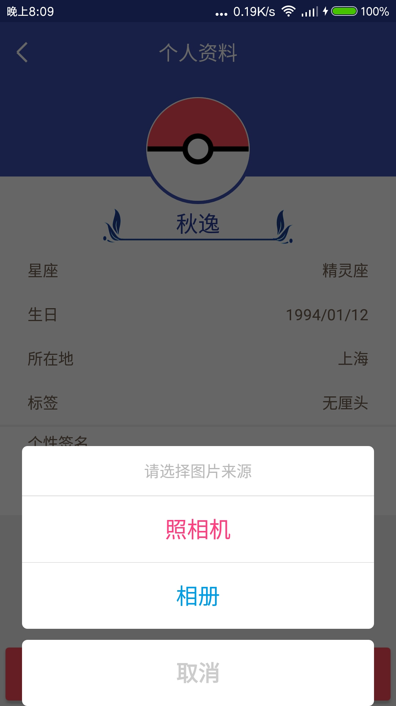
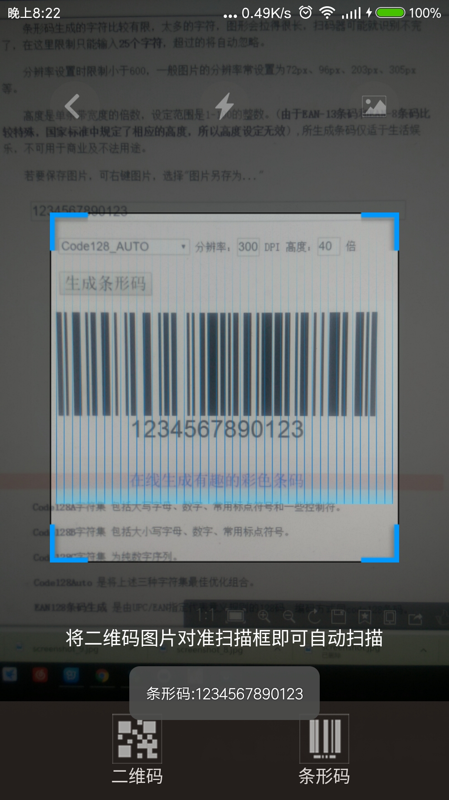
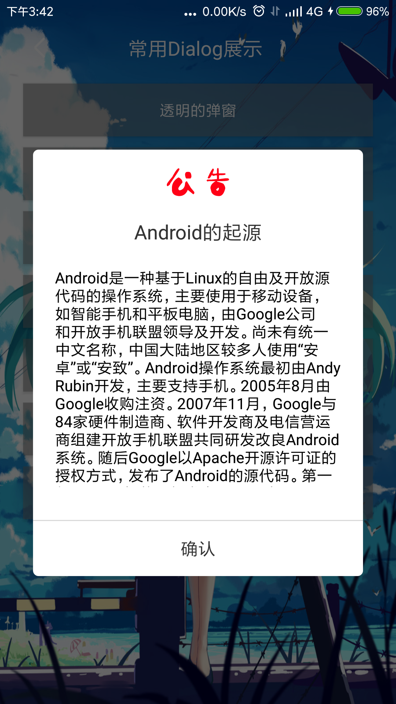
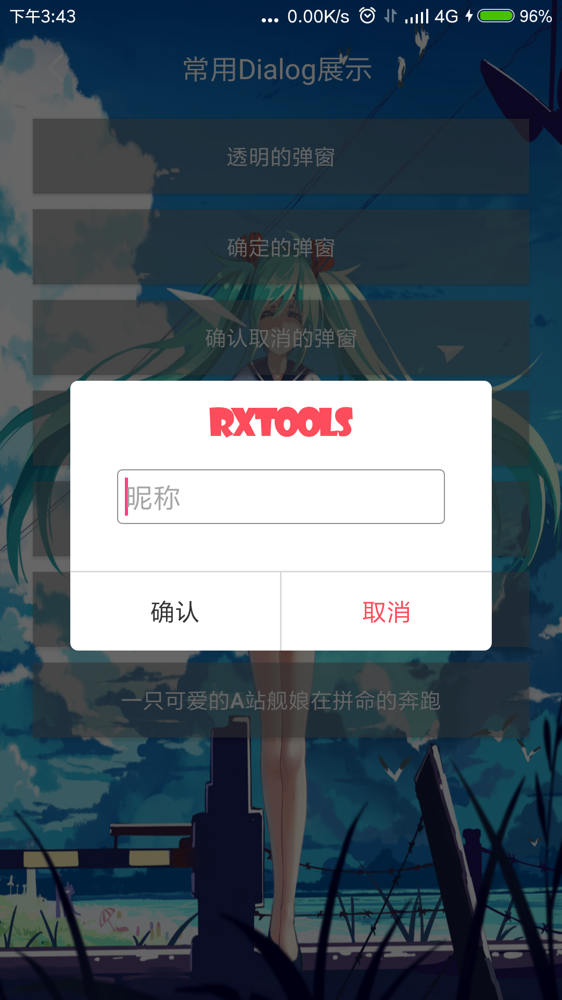
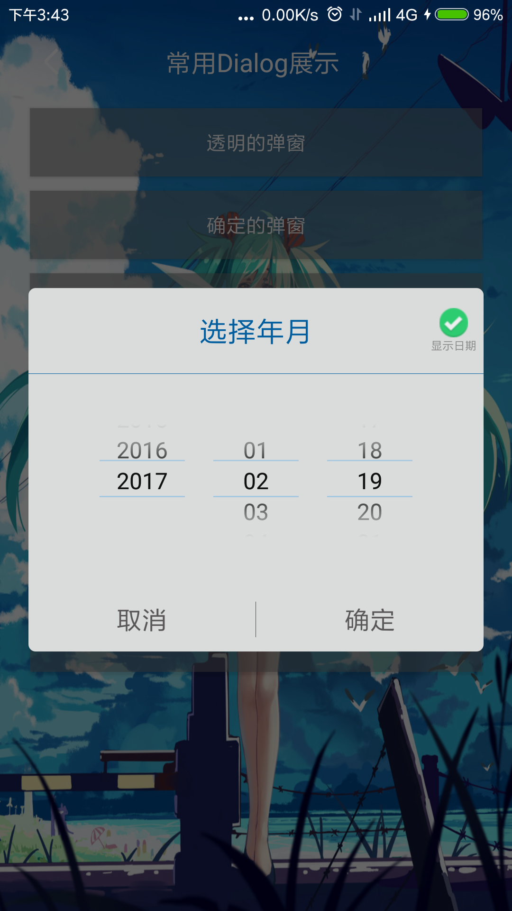
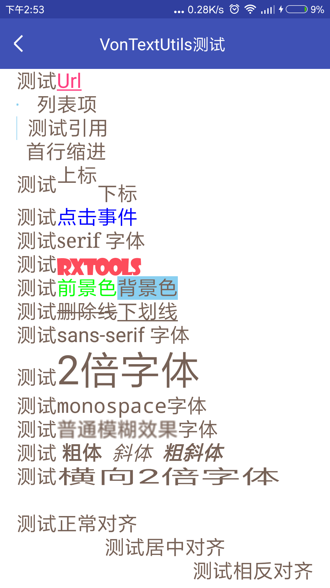
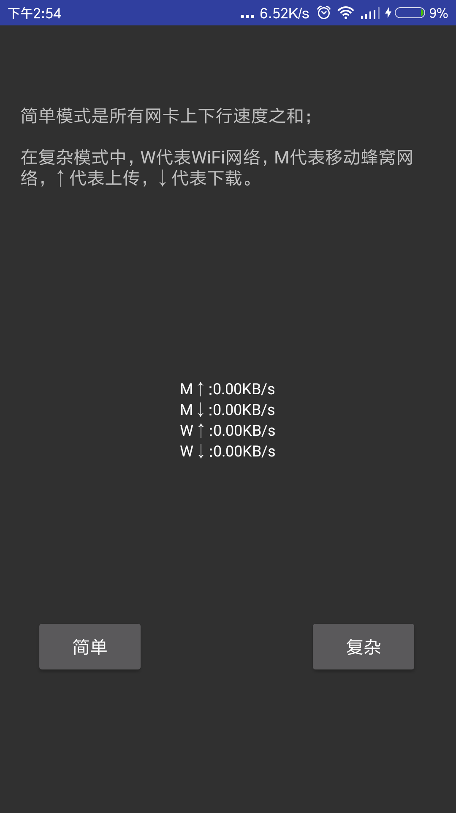
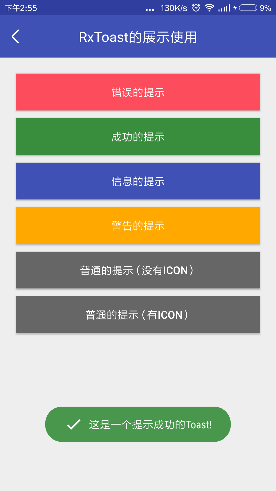

# RxTools [](https://jitpack.io/#vondear/RxTools)  [](https://android-arsenal.com/api?level=14)


    工欲善其事必先利其器！
    Android开发过程经常需要用到各式各样的工具类，虽然大部分只需谷歌/百度一下就能找到；
    但是有时候急需使用却苦苦搜寻不到，于是整理了自己平常用到的工具类，以便以后的使用。

## 如何使用它

> Step 1.先在 build.gradle(Project:XXXX) 的 repositories 添加::

	allprojects {
		repositories {
			...
			maven { url "https://jitpack.io" }
		}
	}
> Step 2. 然后在 build.gradle(Module:app) 的 dependencies 添加:

	dependencies {
	       compile 'com.github.vondear:RxTools:v1.6.5'//请替换成上方 JitPack 最新的版本号
	}

    使用方法：
        在Application中初始化 RxUtils.init(this);
        
## APK文件

扫描二维码 或者 点击二维码 下载

[](https://github.com/vondear/RxTools/blob/master/RxTools.apk)


## 自定义控件介绍

    RxToast                     : Toast的封装
    RxTitle                     : 自定义标题控件
    RxTextAutoZoom              : 文字根据布局大小自动缩放效果
    RxRunTextView               : TextView实现跑马灯效果
    RxTextviewVertical          : 单行文字上下滚动
    RxTextViewVerticalMore      : 多行文字上下滚动
    RxAutoImageView             : ImageView实现自动左右移动效果
    RxBarCode                   : 条形码控件(需拷贝jniLibs目录)
    RxQRCode                    : 二维码控件(需拷贝jniLibs目录)
    RxNetSpeedView              : 显示当前网速控件
    RxToolTip                   : 实现popupWindow效果
    RxRoundProgress             : 实现弧形进度条
    RxProgressBar               : 自定义进度条
    RxShoppingView              : 商品数量加减控件
    RxSeatMovie                 : 电影院选座控件
    RxSeatAirplane              : 飞机票选座控件
    RxRulerWheelView            : 刻度横向滚动控件
    RxCaptcha                   : 验证码控件
    
## Dialog的封装（RxDialog）

    skipTools                   : 隐藏头部导航栏状态栏
    setFullScreen               : 文字根据布局大小自动缩放效果
    setFullScreenWidth          : 设置宽度match_parent
    setFullScreenHeight         : 设置高度为match_parent
    setOnWhole                  : 设置成全局Dialog

## Activity的封装

    ActivityBase                : 封装了FragmentActivity与Context成员参数
    ActivityCodeTool            : 封装了生成二维码与条形码的Activity
    ActivityScanerCode          : 封装了扫描二维码与条形码的Activity
    ActivityWebView             : 封装了可播放视频、获取网页标题并可根据内容自动适应大小WebView的Activity

## Demo介绍
```
RxPhotoUtils操作UCrop裁剪图片
```
  

```
二维码与条形码的扫描与生成
```
    

```
常用的Dialog展示
```
  

  

```
其他功能展示
```
  

  

## 功能模块介绍

> 常用功能 -> RxUtils.java

    hideKeyboard                : 点击隐藏软键盘
    countDown                   : 倒计时(获取验证码倒计时)
    showToast                   : 封装了Toast的方法
    fixListViewHeight           : 手动计算出listView的高度，但是不再具有滚动效果
    createQRImage               : 生成二维码
    drawLinecode                : 生成条形码
    Md5                         : 生成MD5加密32位字符串
    

> 图像操作相关 -> RxImageUtils.java

    单位转换
    dp2px                       : dp转px
    dip2px                      : dip转px
    px2dp                       : px转dp
    px2dip                      : px转dip
    sp2px                       : sp转px
    px2sp                       : px转sp
    
    图片处理相关
    bitmap2Bytes                : bitmap转byteArr
    bytes2Bitmap                : byteArr转bitmap
    drawable2Bitmap             : drawable转bitmap
    bitmap2Drawable             : bitmap转drawable
    drawable2Bytes              : drawable转byteArr
    bytes2Drawable              : byteArr转drawable
    calculateInSampleSize       : 计算采样大小
    getBitmap                   : 从文件/InputStream流/resId中获取bitmap
    scale                       : 缩放图片
    clip                        : 裁剪图片
    skew                        : 倾斜图片
    rotate                      : 旋转图片
    getRotateDegree             : 获取图片旋转角度
    toRound                     : 转为圆形图片
    toRoundCorner               : 转为圆角图片
    fastBlur                    : 快速模糊
    renderScriptBlur            : renderScript模糊图片(API大于17)
    stackBlur                   : stack模糊图片
    addFrame                    : 添加颜色边框
    addReflection               : 添加倒影
    addTextWatermark            : 添加文字水印
    addImageWatermark           : 添加图片水印
    toAlpha                     : 转为alpha位图
    toGray                      : 转为灰度图片
    save                        : 保存图片
    isImage                     : 根据文件名判断文件是否为图片
    getImageType                : 获取图片类型
    
    图片压缩有关
    compressByScale             : 按缩放压缩
    compressByQuality           : 按质量压缩
    compressBySampleSize        : 按采样大小压缩
    
    GetLocalOrNetBitmap         : 得到本地或者网络上的bitmap
    getColorByInt               : 将16进制的颜色转化成10进制
    FilpAnimation               : 界面翻转动画
    
> 数据处理相关 -> RxDataUtils.java

    数据的判断
    isNullString                ：判断字符串是否为空 为空即true
    isEmpty                     : 判断对象是否为空 为空即true
    isInteger                   ：判断字符串是否是整数
    isDouble                    ：判断字符串是否是浮点数
    isNumber                    ：判断字符串是否是数字
    getAstro                    ：根据日期判断星座
    
    数据的转换
    stringToInt                 ：字符串转换成整数 ,转换失败将会 return 0;
    stringToLong                ：字符串转换成long ,转换失败将会 return 0;
    stringToDouble              ：字符串转换成double ,转换失败将会 return 0;
    simpleDateFormat            ：将date转换成format格式的日期
    Date2Timestamp              ： 将日期字符串 按照 指定的格式 转换成 DATE
    getDate                     ：时间戳  转换成 指定格式的日期
    string2Timestamp            ：将 yyyy年MM月dd日 转换成 时间戳
    getCurrentDateTime          ：获取当前日期时间 / 得到今天的日期
    getYestoryDate              ：得到昨天的日期
    formatTime                  ：视频时间 转换成 "mm:ss"
    formatSeconds               ："mm:ss" 转换成 视频时间
    getDaysByYearMonth          ：根据年 月 获取对应的月份 天数
    StringToInputStream         ：字符串转InputStream
    upperFirstLetter            ：首字母大写
    lowerFirstLetter            ：首字母小写
    reverse                     ：反转字符串
    toDBC                       ：转化为半角字符
    toSBC                       ：转化为全角字符
    oneCn2ASCII                 ：单个汉字转成ASCII码
    oneCn2PY                    ：单个汉字转成拼音
    getPYFirstLetter            ：获得第一个汉字首字母
    cn2PY                       ：中文转拼音
    bytes2HexString             ：byteArr转hexString
    hexString2Bytes             ：hexString转byteArr
    hex2Dec                     ：hexChar转int
    chars2Bytes                 ：charArr转byteArr
    bytes2Chars                 ：byteArr转charArr
    byte2Size                   ：字节数转以unit为单位的size
    size2Byte                   ：以unit为单位的size转字节数
    byte2FitSize                ：字节数转合适大小
    input2OutputStream          ：inputStream转outputStream
    output2InputStream          ：outputStream转inputStream
    inputStream2Bytes           ：inputStream转byteArr
    bytes2InputStream           ：byteArr转inputStream
    outputStream2Bytes          ：outputStream转byteArr
    bytes2OutputStream          ：outputStream转byteArr
    inputStream2String          ：inputStream转string按编码
    string2InputStream          ：string转inputStream按编码
    outputStream2String         ：outputStream转string按编码
    string2OutputStream         ：string转outputStream按编码
    
    正则判断
    isMobile                    ：判断是否为真实手机号
    isMobileSimple              ：验证手机号（简单）
    isMobileExact               ：验证手机号（精确）
    isTel                       ：验证电话号码
    isBankCard                  ：验证银卡卡号
    validateIdCard              ：15位和18位身份证号码的正则表达式 身份证验证
    isIDCard15                  ：验证身份证号码15位
    isIDCard18                  ：验证身份证号码18位
    isEmail                     ：验证邮箱
    isURL                       ：验证URL
    isChz                       ：验证汉字
    isUsername                  ：验证用户名
    isDate                      ：验证yyyy-MM-dd格式的日期校验，已考虑平闰年
    isIP                        ：验证IP地址
    isMatch                     ：string是否匹配regex
    stringFormat                : String.Format方法的封装
    
    hideMobilePhone             ：隐藏手机中间4位号码
    formatCard                  ：格式化银行卡 隐藏中间8位号码
    formatCardEndFour           ：获取银行卡后四位
    format2Decimals             ：将字符串格式化为带两位小数的字符串
    
> RxActivityUtils

    isExistActivity             : 判断是否存在指定Activity
    launchActivity              : 打开指定的Activity
    skipActivity                : 跳转到指定Activity
    skipActivityAndFinish       : 跳转到指定Activity并关闭当前Activity
    skipActivityAndFinishAll    : 跳转后Finish之前所有的Activity
    skipActivityForResult       : activityForResult封装
    getLauncherActivity         : 获取launcher activity
    
> RxAnimationUtils
    
    animationColorGradient      : 颜色渐变动画
    cardFilpAnimation           : 卡片翻转动画
    
> RxAppUtils

    InstallAPK                  ：安装APK
    installApp                  : 安装App（支持6.0）
    installAppSilent            : 静默安装App
    uninstallApp                : 卸载App
    uninstallAppSilent          : 静默卸载App
    isAppRoot                   : 判断App是否有root权限
    launchApp                   : 打开App
    getAppPackageName           : 获取App包名
    getAppDetailsSettings       : 获取App具体设置
    getAppName                  : 获取App名称
    getAppIcon                  : 获取App图标
    getAppPath                  : 获取App路径
    getAppVersionName           : 获取App版本号
    getAppVersionCode           : 获取App版本码
    isSystemApp                 : 判断App是否是系统应用
    isAppDebug                  : 判断App是否是Debug版本
    getAppSignature             : 获取App签名
    getAppSignatureSHA1         : 获取应用签名的的SHA1值
    isInstallApp                : 判断App是否安装
    getAppInfo                  : 获取当前App信息
    getBean                     : 得到AppInfo的Bean
    getAllAppsInfo              : 获取所有已安装App信息
    isAppBackground             ：判断当前App处于前台还是后台
    
> 状态栏相关 -> RxBarUtils.java

    setTransparentStatusBar     : 设置透明状态栏(api大于19方可使用)
    hideStatusBar               : 隐藏状态栏
    noTitle                     ：隐藏Title
    FLAG_FULLSCREEN             : 设置全屏
    getStatusBarHeight          : 获取状态栏高度
    isStatusBarExists           : 判断状态栏是否存在
    getActionBarHeight          : 获取ActionBar高度
    showNotificationBar         : 显示通知栏
    hideNotificationBar         : 隐藏通知栏
    invokePanels                : 反射唤醒通知栏
    
> 照相机相关 -> RxCameraUtils.java
    
    getOpenCameraIntent         : 获取打开照程序界面的Intent
    getImagePickerIntent        : 获取[跳转至相册选择界面,并跳转至裁剪界面，可以指定是否缩放裁剪区域]的Intent
    getCameraIntent             : 获取[跳转至相册选择界面,并跳转至裁剪界面，默认可缩放裁剪区域]的Intent
    getCropImageIntent          : 获取[跳转至裁剪界面]的Intent
    getChoosedImage             : 获得选中相册的图片
    getChoosedImagePath         : 获得选中相册的图片路径
    getTakePictureFile          : 获取拍照之后的照片文件（JPG格式）
    
> 常量相关 -> RxConstUtils.java

    存储相关常量
    BYTE                        : Byte与Byte的倍数
    KB                          : KB与Byte的倍数
    MB                          : MB与Byte的倍数
    GB                          : GB与Byte的倍数
    
    时间相关常量
    MSEC                        : 毫秒与毫秒的倍数
    SEC                         : 秒与毫秒的倍数
    MIN                         : 分与毫秒的倍数
    HOUR                        : 时与毫秒的倍数
    DAY                         : 天与毫秒的倍数
    
    正则相关常量
    REGEX_MOBILE_SIMPLE         : 手机号（简单）
    REGEX_MOBILE_EXACT          : 手机号（精确）
    REGEX_TEL                   : 电话号码
    REGEX_IDCARD15              : 身份证号码15位
    REGEX_IDCARD18              ：身份证号码18位
    REGEX_EMAIL                 ：邮箱
    REGEX_URL                   ：URL
    REGEX_CHZ                   ：汉字
    REGEX_USERNAME              ：用户名，取值范围为a-z,A-Z,0-9,"_",汉字，不能以"_"结尾,用户名必须是6-20位
    REGEX_DATE                  ：yyyy-MM-dd格式的日期校验，已考虑平闰年
    REGEX_IP                    ：IP地址
    
> 编码解码相关工具类 -> RxEncodeUtils.java
    
    urlEncode                   ：URL编码
    urlDecode                   ：URL解码
    base64Encode                ：Base64编码
    base64Encode2String         ：Base64编码
    base64Decode                ：Base64解码
    base64UrlSafeEncode         ：Base64URL安全编码
    htmlEncode                  ：Html编码
    htmlDecode                  ：Html解码
    
> 加密解密相关的工具类 -> RxEncryptUtils.java
    
    哈希加密相关
    encryptMD2ToString          ：MD2加密
    encryptMD2                  ：MD2加密
    encryptMD5ToString          ：MD5加密
    encryptMD5                  ：MD5加密
    encryptMD5File2String       ：MD5加密文件
    encryptMD5File              ：MD5加密文件
    encryptSHA1ToString         ：SHA1加密
    encryptSHA1                 ：SHA1加密
    encryptSHA224ToString       ：SHA224加密
    encryptSHA224               ：SHA224加密
    encryptSHA256ToString       ：SHA256加密
    encryptSHA256               ：SHA256加密
    encryptSHA384ToString       ：SHA384加密
    encryptSHA384               ：SHA384加密
    encryptSHA512ToString       ：SHA512加密
    encryptSHA512               ：SHA512加密
    encryptAlgorithm            ：对data进行algorithm算法加密
    
    DES加密相关
    DESTemplet                  ：DES加密
    encryptDES                  ：DES加密
    encryptDES2Base64           ：DES加密后转为Base64编码
    encryptDES2HexString        ：DES加密后转为16进制
    decryptBase64DES            ：DES解密Base64编码密文
    decryptHexStringDES         ：DES解密16进制密文
    decryptDES                  ：DES解密
    
    3DES加密相关
    encrypt3DES2Base64          ：3DES加密后转为Base64编码
    encrypt3DES2HexString       ：3DES加密后转为16进制
    encrypt3DES                 ：3DES加密
    decryptBase64_3DES          ：3DES解密Base64编码密文
    decryptHexString3DES        ：3DES解密16进制密文
    decrypt3DES                 ：3DES解密
    
    AES加密相关
    encryptAES2Base64           ：AES加密后转为Base64编码
    encryptAES2HexString        ：AES加密后转为16进制
    encryptAES                  ：AES加密
    decryptBase64AES            ：AES解密Base64编码密文
    decryptHexStringAES         ：AES解密16进制密文
    decryptAES                  ：AES解密
    
> 文件操作相关 -> RxFileUtils.java

    SD卡操作
    getRootPath                 : 得到SD卡根目录
    getCecheFolder              ：获取本应用图片缓存目录
    isSDCardEnable              ：判断SD卡是否打开
    getSDCardPath               ：获取SD卡路径
    getDataPath                 ：获取SD卡Data路径
    getFreeSpace                ：获取SD卡剩余空间
    sdCardIsAvailable           ：SD卡是否可用
    
    fileExists                  ：文件或者文件夹是否存在
    delAllFile                  ：删除指定文件夹下所有文件, 不保留文件夹.
    copy                        ：文件复制(文件路径)
    copyFile                    ：复制文件(文件/InputStream流)
    copyFolder                  ：复制整个文件夹内
    renameFile                  ：重命名文件
    getSDCardAvailaleSize       ：获取磁盘可用空间
    getDirSize                  ：获取某个目录可用大小
    getFileAllSize              ：获取文件或者文件夹大小
    initFile                    ：创建一个文件
    initDirectory               ：创建一个文件夹
    saveFile                    ：保存InputStream流到文件
    saveFileUTF8                ：用UTF8保存一个文件
    getFileUTF8                 ：用UTF8读取一个文件
    getFileIntent               ：得到一个文件Intent
    getDiskCacheDir             ：获取缓存目录
    getDiskFileDir              ：获取缓存视频文件目录
    mergeFiles                  ：多个文件拼接合并
    getNativeM3u                ：将在线的m3u8替换成本地的m3u8
    write                       ：将字符串 保存成 文件
    TextToFile                  ：传入文件名以及字符串, 将字符串信息保存到文件中
    GetAllFileName              ：获取 搜索的路径 下的 所有 后缀 的文件
    readFileByLines             ：以行为单位读取文件，常用于读面向行的格式化文件
    getFileByPath               ：根据文件路径获取文件
    isFileExists                ：判断文件是否存在
    isDir                       ：判断是否是目录
    isFile                      ：判断是否是文件
    createOrExistsDir           ：判断目录是否存在，不存在则判断是否创建成功
    createOrExistsFile          ：判断文件是否存在，不存在则判断是否创建成功
    createFileByDeleteOldFile   ：判断文件是否存在，存在则在创建之前删除
    copyOrMoveDir               ：复制或移动目录
    copyOrMoveFile              ：复制或移动文件
    copyDir                     ：复制目录
    copyFile                    ：复制文件
    moveDir                     ：移动目录
    moveFile                    ：移动文件
    deleteDir                   ：删除目录
    deleteFile                  ：删除文件    
    listFilesInDir              ：获取目录下所有文件
    listFilesInDirWithFilter    ：获取目录下所有后缀名为suffix的文件
    searchFileInDir             ：获取目录下指定文件名的文件包括子目录
    writeFileFromIS             ：将输入流写入文件
    writeFileFromString         ：将字符串写入文件
    readFile2List               ：指定编码按行读取文件到List
    readFile2String             ：指定编码按行读取文件到字符串中
    readFile2Bytes              ：指定编码按行读取文件到字符数组中
    getFileCharsetSimple        ：简单获取文件编码格式
    getFileLines                ：获取文件行数
    getFileSize                 ：获取文件大小
    getFileMD5                  ：获取文件的MD5校验码
    closeIO                     ：关闭IO
    getDirName                  ：获取全路径中的最长目录
    getFileName                 ：获取全路径中的文件名
    getFileNameNoExtension      ：获取全路径中的不带拓展名的文件名
    getFileExtension            ：获取全路径中的文件拓展名
    
    清除数据
    cleanInternalCache          : 清除内部缓存
    cleanInternalFiles          : 清除内部文件
    cleanInternalDbs            : 清除内部数据库
    cleanInternalDbByName       : 根据名称清除数据库
    cleanInternalSP             : 清除内部SP
    cleanExternalCache          : 清除外部缓存
    cleanCustomCache            : 清除自定义目录下的文件
    
> 剪贴板相关 -> RxClipboardUtils.java

    copyText                    : 复制文本到剪贴板
    getText                     : 获取剪贴板的文本
    copyUri                     : 复制uri到剪贴板
    getUri                      : 获取剪贴板的uri
    copyIntent                  : 复制意图到剪贴板
    getIntent                   : 获取剪贴板的意图
    
> 进程相关 -> RxProcessUtils.java

    getForegroundProcessName    : 获取前台线程包名
    getAllBackgroundProcesses   : 获取后台服务进程
    killAllBackgroundProcesses  : 杀死所有后台服务进程
    killBackgroundProcesses     : 杀死后台服务进程
    
> Intent相关 -> RxIntentUtils.java

    getInstallAppIntent         : 获取安装App(支持6.0)的意图
    getUninstallAppIntent       : 获取卸载App的意图
    getLaunchAppItent           : 获取打开App的意图
    getAppInfoIntent            : 获取App信息的意图
    getShareInfoIntent          : 获取App信息分享的意图
    getIntentByPackageName      : 根据包名获取意图
    getComponentNameIntent      : 获取其他应用的Intent
    
> 键盘相关 -> RxKeyboardUtils.java

    hideSoftInput               : 动态隐藏软键盘
    showSoftInput               : 动态显示软键盘
    toggleSoftInput             : 切换键盘显示与否状态
    
> 网络相关 -> RxNetUtils.java

    ping                        : 判断是否有外网连接
    isWifiEnabled               : 判断WIFI是否打开
    is3rd                       : 判断是否为3G网络
    isWifi                      : 判断网络连接方式是否为WIFI
    isNetworkAvailable          : 判断网络连接是否可用
    isGpsEnabled                : GPS是否打开
    getNetWork                  : 获取当前网络状态
    openWirelessSettings        : 打开网络设置界面
    getActiveNetworkInfo        : 获取活动网络信息
    isAvailable                 : 判断网络是否可用
    isConnected                 : 判断网络是否连接
    is4G                        : 判断网络是否是4G
    isWifiConnected             : 判断wifi是否连接状态
    getNetworkOperatorName      : 获取移动网络运营商名称
    getPhoneType                : 获取移动终端类型
    getNetWorkType              : 获取当前的网络类型
    getNetWorkTypeName          : 获取当前的网络类型名称
    
> 图片获取相关 -> RxPhotoUtils.java

    openCameraImage             : 调用系统相机
    openLocalImage              : 调用系统相册
    cropImage                   : 裁剪图片
    createImagePathUri          : 创建一条图片地址uri,用于保存拍照后的照片
    getRealFilePath             : 获取图片uri的真实文件地址

> Service相关 -> RxServiceUtils.java

    isRunningService            : 获取服务是否开启
    
> Shell相关 -> RxShellUtils.java

    isRoot                      : 判断设备是否root
    execCmd                     : 是否是在root下执行命令
    
> SharedPreferences相关 -> RxSPUtils.java

    putContent                  : 单条方式存入SharedPreferences
    getContent                  : 获取标记为tag的值
    putJSONCache                : 存放JSON缓存数据
    readJSONCache               : 读取JSON缓存数据
    clearPreference             : 清除指定的信息(若为null 则删除name下所有的键值)
    
> 时间相关 -> RxTimeUtils.java
    
    milliseconds2String         : 将时间戳转为时间字符串
    string2Milliseconds         : 将时间字符串转为时间戳
    string2Date                 : 将时间字符串转为Date类型
    date2String                 : 将Date类型转为时间字符串
    date2Milliseconds           : 将Date类型转为时间戳
    milliseconds2Date           : 将时间戳转为Date类型
    milliseconds2Unit           : 毫秒时间戳单位转换
    getIntervalTime             : 获取两个时间差
    getCurTimeMills             : 获取当前时间戳
    getCurTimeString            : 获取当前时间字符串
    getCurTimeDate              : 获取当前时间
    getIntervalByNow            : 获取与当前时间的差
    isLeapYear                  : 判断闰年
    
    
> 压缩相关 -> RxZipUtils.java

    zipFiles                    : 批量压缩文件
    zipFile                     : 压缩文件
    unzipFiles                  : 批量解压文件
    unzipFile                   : 解压文件
    unzipFileByKeyword          : 解压带有关键字的文件
    getFilesPath                : 获取压缩文件中的文件路径链表
    getComments                 : 获取压缩文件中的注释链表
    getEntries                  : 获取压缩文件中的文件对象
    

> 线程池相关工具类 -> RxThreadPoolUtils.java

    RxThreadPoolUtils          ：ThreadPoolUtils构造函数
    execute                     ：在未来某个时间执行给定的命令(链表)
    shutDown                    ：待以前提交的任务执行完毕后关闭线程池
    shutDownNow                 ：试图停止所有正在执行的活动任务
    isShutDown                  ：判断线程池是否已关闭
    isTerminated                ：关闭线程池后判断所有任务是否都已完成
    awaitTermination            ：请求关闭、发生超时或者当前线程中断
    submit                      ：提交一个Runnable任务用于执行
    invokeAll                   ：执行给定的任务
    invokeAny                   ：执行给定的任务
    schedule                    ：延迟执行Runnable命令
    scheduleWithFixedRate       ：延迟并循环执行命令
    scheduleWithFixedDelay      ：延迟并以固定休息时间循环执行命令
    
 
 > 设备工具类 -> RxDeviceUtils.java   
 
    屏幕相关
    getScreenHeight             ：得到屏幕的高
    getScreenWidth              ：得到屏幕的宽
    getScreenWidths             ：得到设备屏幕的宽度
    getScreenHeights            ：得到设备屏幕的高度
    getScreenDensity            ：得到设备的密度
    
    setLandscape                ：设置屏幕为横屏
    setPortrait                 ：设置屏幕为竖屏
    isLandscape                 ：判断是否横屏
    isPortrait                  ：判断是否竖屏
    getScreenRotation           ：获取屏幕旋转角度
    captureWithStatusBar        ：获取当前屏幕截图，包含状态栏
    captureWithoutStatusBar     ：获取当前屏幕截图，不包含状态栏
    getDisplayMetrics           ：获取DisplayMetrics对象
    isScreenLock                ：判断是否锁屏
    
    硬件信息相关
    getUniqueSerialNumber       ：获取手机唯一标识序列号
    getIMEI                     ：获取设备的IMEI
    getIMSI                     ：获取设备的IMSI
    getDeviceSoftwareVersion    ：获取设备的软件版本号
    getLine1Number              ：获取手机号
    getNetworkCountryIso        ：获取ISO标准的国家码，即国际长途区号
    getNetworkOperator          ：获取设备的 MCC + MNC
    getNetworkOperatorName      ：获取(当前已注册的用户)的名字
    getNetworkType              ：获取当前使用的网络类型
    getPhoneType                ：获取手机类型
    getSimCountryIso            ：获取SIM卡的国家码
    getSimOperator              ：获取SIM卡提供的移动国家码和移动网络码.5或6位的十进制数字
    getSimOperatorName          ：获取服务商名称
    getSimSerialNumber          ：获取SIM卡的序列号
    getSimState                 ：获取SIM的状态信息
    getSubscriberId             ：获取唯一的用户ID
    getVoiceMailNumber          ：获取语音邮件号码
    getAndroid_id               ：获取ANDROID ID
    getBuildBrandModel          ：获取设备型号，如MI2SC
    getBuildBrand               ：获取设备品牌名称
    getBuildMANUFACTURER        ：获取设备厂商，如Xiaomi
    getSerialNumber             ：获取序列号
    getAppVersionNo             ：获取App版本号
    getAppVersionName           ：获取App版本名称
    checkPermission             ：检查权限
    getDeviceInfo               ：获取设备信息
    ThroughArray                ：遍历LOG输出HashMap
    getMacAddress               ：获取设备MAC地址
    
    手机操作相关
    isPhone                     ：判断设备是否是手机
    getPhoneStatus              ：获取手机状态信息
    dial                        ：跳至填充好phoneNumber的拨号界面
    callPhone                   ：拨打电话
    sendSms                     ：发送短信
    getAllContactInfo           ：获取手机联系人
    getContantNum               ：打开手机联系人界面点击联系人后便获取该号码
    getAllSMS                   ：获取手机短信并保存到xml中
           
## 支付工具类
### 支付宝支付：
    
        AliPayTools.aliPay(mContext,
            APP_ID,//支付宝分配的APP_ID
            isRSA2,//是否是 RSA2 加密
            RSA_PRIVATE,// RSA 或 RSA2 字符串
            new AliPayModel(order_id,//订单ID (唯一)
                            money,//价格
                            name,//商品名称
                            detail),//商品描述详情 (用于显示在 支付宝 的交易记录里)
            new onRequestListener() {
                @Override
                public void onSuccess(String s) {RxToast.success("支付成功");}
                                                                                            
                @Override
                public void onError(String s) {RxToast.error("支付失败");
            }
        });
        
### 微信支付:

> 第一种情景：支付操作全部在APP端完成(包括统一下单接口) 即支付过程无后台参与
        
        WechatPayTools.wechatPayUnifyOrder(mContext,
            WX_APP_ID, //微信分配的APP_ID
            WX_PARTNER_ID, //微信分配的 PARTNER_ID (商户ID)
            WX_PRIVATE_KEY, //微信分配的 PRIVATE_KEY (私钥)
            new WechatModel(order_id, //订单ID (唯一)
                            money, //价格
                            name, //商品名称
                            detail), //商品描述详情
            new onRequestListener() {
                @Override
                public void onSuccess(String s) {}
    
                @Override
                public void onError(String s) {}
        });
        
> 第二种情景：从后台获取到 prepayid（预支付订单ID） 之后,在App端进行支付操作
        
        wechatPayApp(mContext,
            app_id, //微信分配的APP_ID
            partner_id, //微信分配的 PARTNER_ID (商户ID)
            wx_private_key, //微信分配的 PRIVATE_KEY (私钥)
            prepay_id, //订单ID (唯一)
            new onRequestListener() {
                @Override
                public void onSuccess(String s) {}
    
                @Override
                public void onError(String s) {}
        });
        
### 微信分享:

>  分享网页

        WechatShareTools.init(mContext, WX_APP_ID);//初始化
        
        String url = "https://github.com/vondear/RxTools";//网页链接        
        
        String description = "工欲善其事必先利其器！";//描述       
        
        Bitmap bitmap = BitmapFactory.decodeResource(getResources(), R.mipmap.ic_launcher);//获取Bitmap
        byte[] bitmapByte = RxImageUtils.bitmap2Bytes(bitmap, Bitmap.CompressFormat.PNG);//将 Bitmap 转换成 byte[]
        
        mWechatShareModel = new WechatShareModel(url, "APP名称", description, bitmapByte);
        
        //Friend 分享微信好友,Zone 分享微信朋友圈,Favorites 分享微信收藏
        WechatShareTools.shareURL(mWechatShareModel, WechatShareTools.SharePlace.Friend);//分享操作






