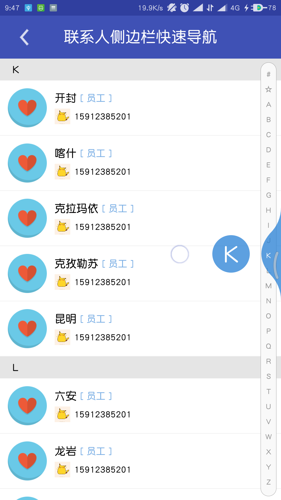
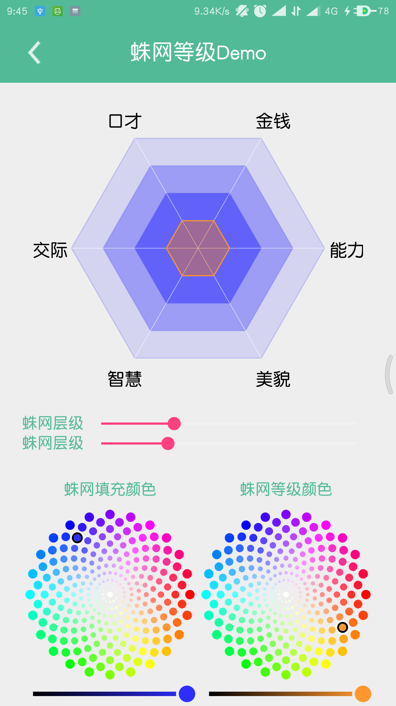
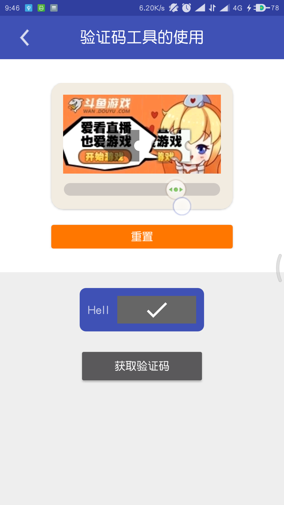

# RxTool       


    工欲善其事必先利其器！
    Android开发过程经常需要用到各式各样的工具类，虽然大部分只需谷歌/百度一下就能找到；
    但是有时候急需使用却苦苦搜寻不到，于是整理了自己平常用到的工具类，以便以后的使用。

## 如何使用它

> Step 1.先在 build.gradle(Project:XXXX) 的 repositories 添加:

	allprojects {
		repositories {
			...
			maven { url "https://jitpack.io" }
		}
	}
> Step 2. 然后在 build.gradle(Module:app) 的 dependencies 添加:

	dependencies {
	       //基础工具库
           implementation "com.github.vondear.RxTool:RxKit:v2.0.4"

	       //UI库
	       implementation "com.github.vondear.RxTool:RxUI:v2.0.4"

	       //功能库（Zxing扫描与生成二维码条形码 支付宝 微信）
           implementation "com.github.vondear.RxTool:RxFeature:v2.0.4"

           //ArcGis For Android工具库（API：100.1以上版本）
           implementation "com.github.vondear.RxTool:RxArcGisKit:v2.0.4"
	}

    使用方法:
        在Application中初始化 RxTool.init(this);

    注：v2.0.0以后版本是分多模块的版本

## 文档
### 可以参考文档来调用相对应的API，欢迎指教
- [点我看文档](https://github.com/vondear/RxTool/wiki/RxTool-Wiki)
- [点我看文档](https://github.com/vondear/RxTool/wiki/RxTool-Wiki)
- [点我看文档](https://github.com/vondear/RxTool/wiki/RxTool-Wiki)

## 近期更新日志

| VERSION | Description |
| ---------- | ------------- |
| v2.0.1     | 新增（高德/百度）地图导航工具 新增ArcGis工具类 |
| v2.0.0     | 重构成多模块 |

## Demo介绍

    RxPhotoTool操作UCrop裁剪图片


| 展示头像 | 选择头像 | 裁剪头像 |
| ---------- | ------------- | ------------- |
|  |  |  |

    二维码与条形码的扫描与生成

| 扫描二维码 | 生成二维码 | 扫描条形码 |
| ---------- | ------------- | ------------- |
|  |  |  |


    常用的Dialog展示

| 确认弹窗 | 确认取消弹窗 | 输入框弹窗 |
| :----------: | :-------------: | :-------------: |
|  |  |  |
| 选择日期弹窗 | 形状加载弹窗 | Acfun加载弹窗 |
|  |  |  |


    其他功能展示

| WebView的封装（可播放视频） | RxTextTool操作Demo | RxToast的展示使用|
| :----------: | :-------------: | :-------------:|
|  |  | |
| 进度条的艺术 | 网速控件 | 联系人侧边栏快速导航
|  |  | |
| 图片的缩放艺术 | 蛛网控件 | 仿斗鱼验证码控件
|  |  | |

#### DEMO 与 打赏

| Demo |
| :----------: |
|  |
| 扫描二维码 or 点击二维码   下载|


| 微信打赏 | 支付宝打赏 |
| :----------: | :----------: |
|  如果你帮助到了你 可以点右上角"Star"支持一下 谢谢！^_^ 你也还可以扫描下面的二维码打赏鼓励一下~  请作者喝一杯咖啡。| 如果在捐赠留言中备注名称 将会被记录到列表中~  如果你也是github开源作者 捐赠时可以留下github项目地址或者个人主页地址 链接将会被添加到列表中起到互相推广的作用 |
|   |    |
| [捐赠列表](Contributor.md) | 闲聊群   435644020 |

